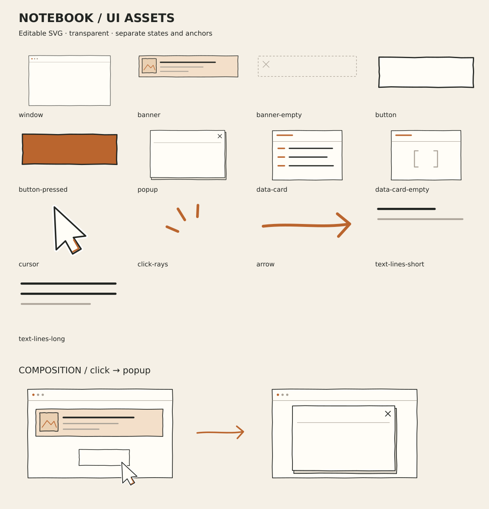

# Notebook UI SVG assets

투명 배경·차콜 선·미색 면·주황 강조의 독립 SVG 13종입니다. 완성 도식과 함께 사용해 설명 장면에 작은 시각적 사건을 더하기 위한 재료입니다. SVG 자체에는 애니메이션이나 특정 대본을 넣지 않았습니다.

| 애셋 | 용도 |
| --- | --- |
| window | 배너·버튼 등을 담는 창 |
| banner / banner-empty | 데이터 있음 / 없음 |
| button / button-pressed | 클릭 전 / 클릭 후 |
| popup | 별도 레이어로 등장하는 팝업 |
| data-card / data-card-empty | 응답 데이터 / 빈 목록 |
| cursor / click-rays | 커서 이동 / 클릭 순간 표시 |
| arrow | 원인과 결과 연결 |
| text-lines-short / text-lines-long | 문구 길이 변화 |

## 배치 계약

`catalog.json`은 SVG viewBox 크기, labelArea `[x,y,width,height]`, 앵커 좌표와 용도를 기록합니다. 좌표에는 투명 여백이 포함됩니다. 크기는 종횡비를 유지합니다.

- 커서 위치: 목표 위치에서 `tip * scale`을 뺀 값을 SVG의 좌상단으로 사용합니다. 커서의 사각형 중심을 버튼에 맞추지 않습니다.
- 레이어 순서: 창 → 배너/데이터 → 글자 → 팝업 → 커서 → 클릭 표시. 커서는 버튼 모서리에 걸치되 글자를 가리지 않습니다.
- 한글은 SVG에 굽지 않고 렌더러의 텍스트로 labelArea에 배치합니다. banner의 `copy`와 `thumbnail` 그룹, data-card의 `rows` 그룹은 인라인 SVG에서 따로 숨기거나 바꿀 수 있습니다.
- SVG를 ``로 불러오면 전체만 움직일 수 있습니다. 내부 그룹을 움직이려면 SVG를 인라인 컴포넌트로 구성해야 합니다. 여러 개를 인라인으로 사용할 때 ID에 장면별 접두사를 붙입니다.
- 사용 예: 커서 이동 → 클릭 표시 → 버튼 상태 교체 → 팝업 등장. 또는 데이터 카드 비우기 → 배너 숨김 → 빈 상태 표시.
- `preview.svg`는 조합 예시이며 실제 영상 렌더가 아닙니다. 기존 완성 도식은 유지할 수 있습니다. `scene.uiMotion`과 `NotebookUiAsset`으로 렌더러에 연결됩니다. 애니메이션 스크리블이 기본이며 라벨은 선명하게 유지합니다.

## 재생성

`python shorts/scripts/create-notebook-svg-assets.py`

Python 표준 라이브러리만 사용합니다. SVG는 도식용으로 직접 작성한 벡터 원본이며 이미지 생성 API를 호출하지 않습니다. 앞서 만든 래스터 커서를 자동 트레이싱하지 않고 같은 시각적 역할의 커서를 벡터로 새로 그렸습니다. 외부 폰트·이미지·스크립트 의존성이 없습니다.

미리보기: `inkscape shorts/public/stickers/notebook-ui-svg/preview.svg --export-type=png --export-filename=shorts/public/stickers/notebook-ui-svg/preview.png --export-width=1152`

제작 톤·SVG 사용·화살표 획 순서·JSON 모션 계약은 [노트 UI 모션 지침](../../../../docs/notebook-ui-motion.md)을 따릅니다.

[실제 장면 JSON의 상태별 배치](scene-motion-preview.svg)는 5·6·8장면의 0.2/0.42/0.58/0.9 진행률 평가 결과입니다. 전체 영상·스크리블·음성 타이밍의 렌더 검증 자료는 아닙니다.
